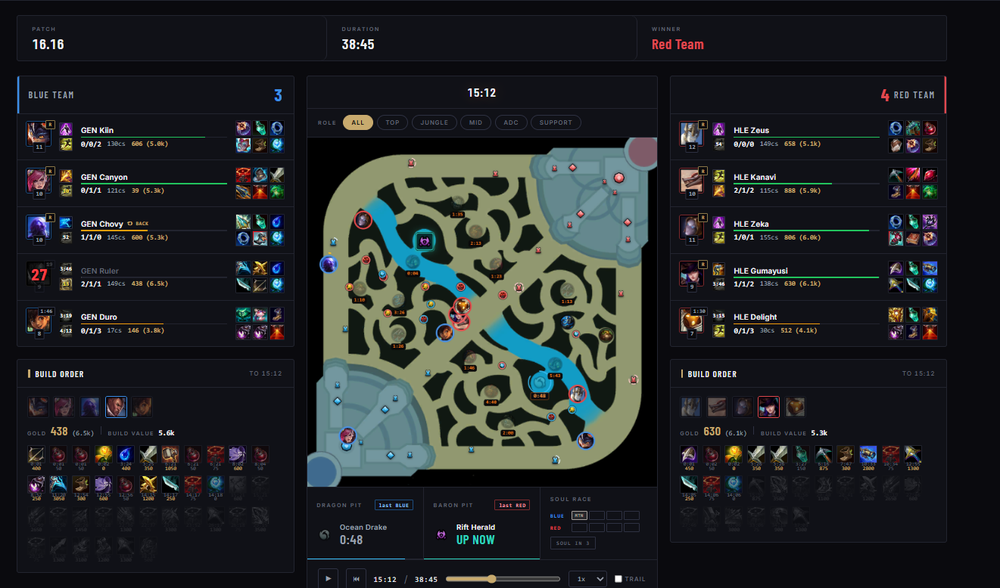

# Minimap Viewer — League of Legends

A single-file browser tool that replays a League of Legends match on the minimap from
exported match data. No install, no server, no build step: open the HTML file and load a match.

Built as a coaching tool for reviewing scrims and competitive matches, where the useful
question is usually *where was everyone, and when* — something a stat sheet cannot answer.

## Features

**On the map**

- **Timeline playback** with play/stop, rewind, a scrubber and speed control up to 10x
- **Player positions by role**, filtered by Top / Jungle / Mid / ADC / Support, or all at once
- **Movement trails**, so you can see where a player came from, not just where they are
- **Live map state** as the timeline advances — turrets, turret plates, inhibitors and nexus
  are drawn only while they are still standing
- **Jungle camps** with live respawn countdowns on each camp
- **Wards** shown while active, **kill markers** stamped with the time of the fight

**Around the map**

- **Live scoreboard** for both teams — champion, player, level, KDA, CS, gold, items,
  summoner spells and keystone, with a recall indicator when a player is backing
- **Build order** per team: every item purchase with its timestamp and cost, plus total build value
- **Objective panels** — dragon and baron pits, showing who took the last one and the countdown
  to the next spawn
- **Soul race** tracker
- **Tooltips** with champion and item detail

## Usage

**[Open the viewer →](https://andrescastrop1.github.io/minimap-viewer-lol/)**

Or download `index.html` and open it locally — it is one self-contained file and runs
straight from the filesystem, no server needed.

Either way, click **Select .jsonl** and choose your match file.

**Input format: a `.jsonl` file** (JSON Lines — one JSON object per line) containing the
match timeline. This is what the viewer expects; a plain `.json` match export will not load.

## Technical notes

- Vanilla JavaScript and HTML canvas — **no dependencies, no build step, no bundler**
- The entire application is one HTML file, so it runs from the local filesystem
- Champion, item and rune art is fetched at runtime from Riot's
  [Data Dragon](https://developer.riotgames.com/docs/lol#data-dragon) and Community Dragon CDNs,
  and cached in the browser
- Nothing is uploaded anywhere: match files are read locally in the browser

## License

MIT — see [LICENSE](LICENSE).

## Disclaimer

Minimap Viewer is not endorsed by Riot Games and does not reflect the views or opinions of
Riot Games or anyone officially involved in producing or managing League of Legends.
League of Legends and Riot Games are trademarks or registered trademarks of Riot Games, Inc.
